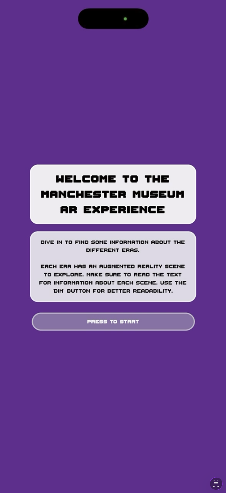
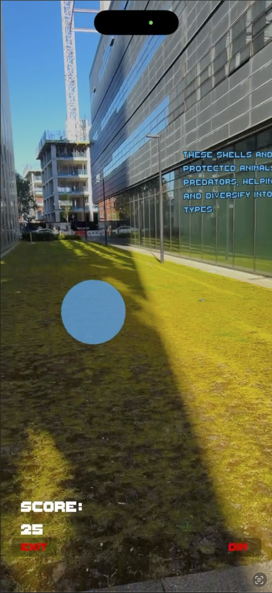
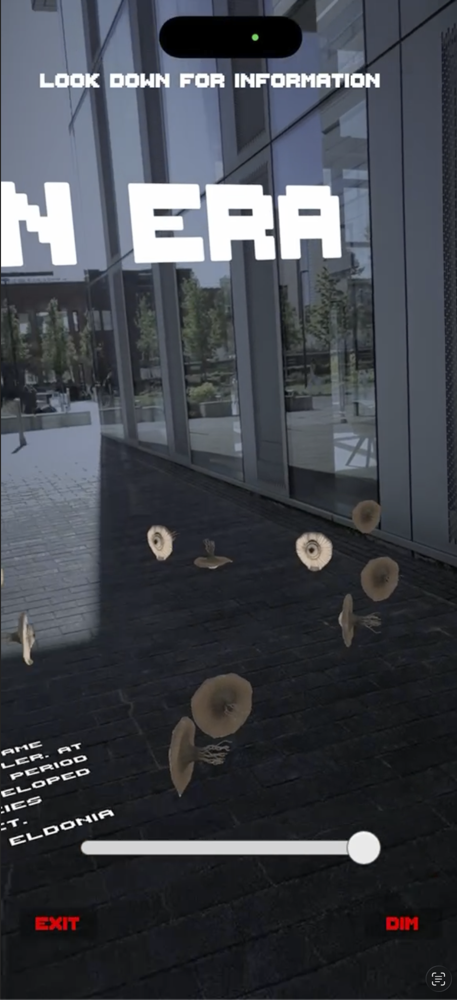
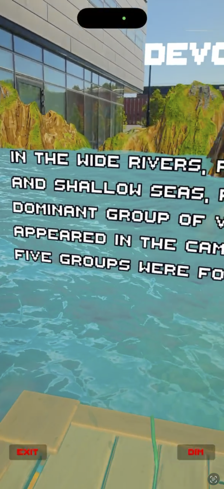
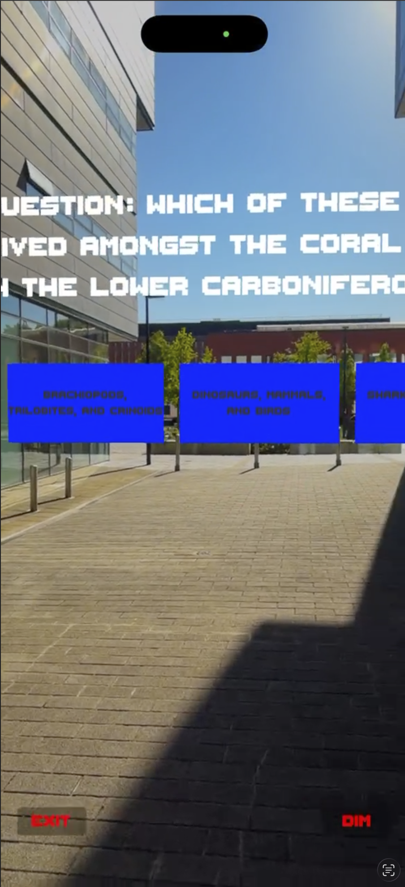
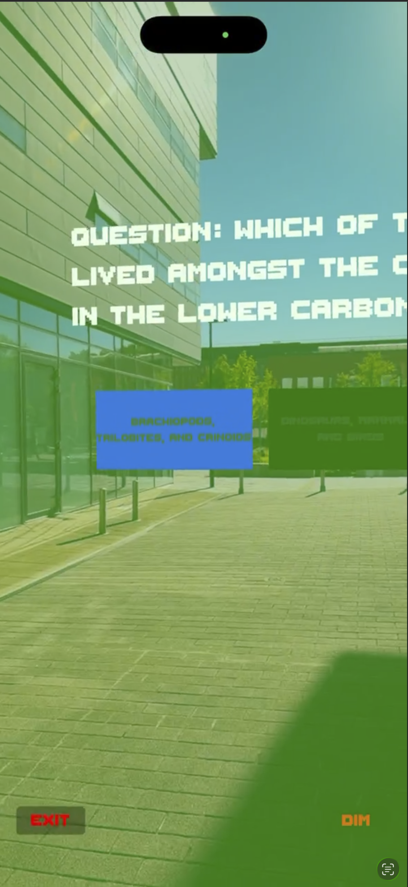
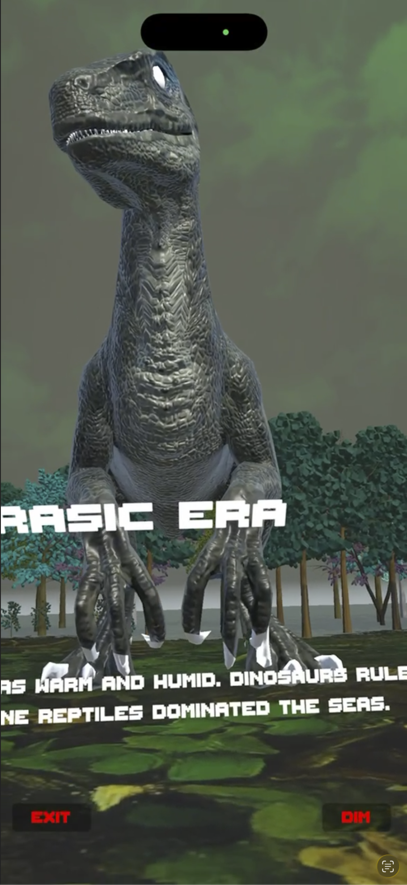

# Unity | C#, ARKIT | AR Project

## Information

This is an iOS augmented reality mobile application developed using Unity with C# for the scripting and application logic. The project explores the use of augmented reality as a tool for improving museum engagement and education by transforming traditional static exhibits into interactive experiences.

The application was designed around the Manchester Museum's Fossils and Dinosaurs Gallery, allowing users to explore geological time periods through interactive AR scenes, environmental reconstructions, and educational interactions. The Unity project was deployed onto an iOS device using Xcode, with ARKit providing the underlying augmented reality functionality.

For more information about the scripts developed for this application and their functionality, see [implementation](/PROJECT_IMPLEMENTATION_HANDOVER.md) and [diagrams](/scene_script_diagrams_for_QA.md).

The application was evaluated with 12 participants to investigate the impact of augmented reality on learning, engagement, and usability. Results showed that the AR experience produced significantly higher engagement compared to the traditional museum experience, with AR participants achieving an average engagement score of 5.47/7 compared to 2.93/7 for the traditional condition. Participants also reported positive subjective learning experiences, with AR achieving an average score of 5.07/7.

Usability testing showed that participants were able to interact with the application effectively, demonstrating that the system provided an accessible and engaging method for exploring museum content through augmented reality.

## Screenshot: Mainscreen

## Screenshot: Throughout the different AR experiences.
Images attached below from some of the scenes.

  
  
  
  

  
  
  
  

