## 1. Persistent Base Scene: `XR+UI.unity`

Main responsibility: keep AR and navigation alive while period scenes are swapped in and out.

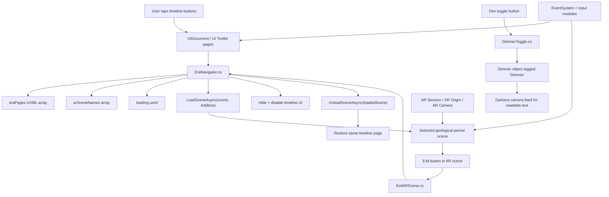

## 2. Main Menu Timeline Page

Main responsibility: introduce the app and move users into the geological timeline.

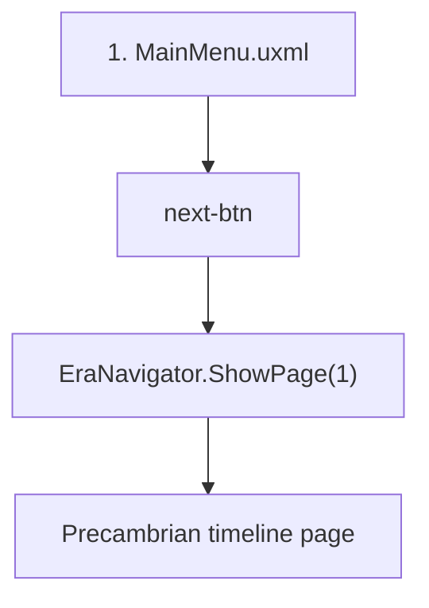

## 3. Precambrian Scene: `1_precambrian`

Main responsibility: visual AR environment and informational content.

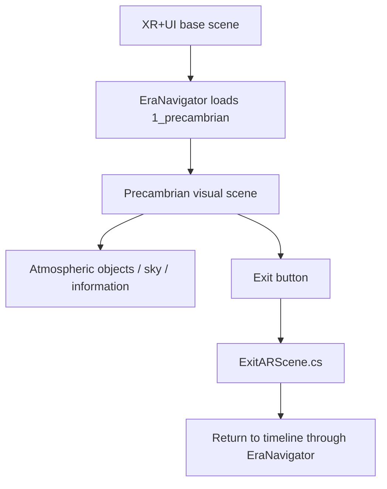

## 4. Cambrian Scene: `2_cambrian`

Main responsibility: bubble-popping interaction with score, facts, and feedback.

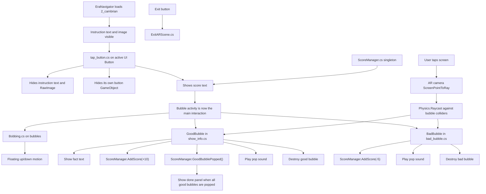

## 5. Ordovician Scene: `3_ordovician`

Main responsibility: slider-controlled climate change, text visibility, and extinction effect.

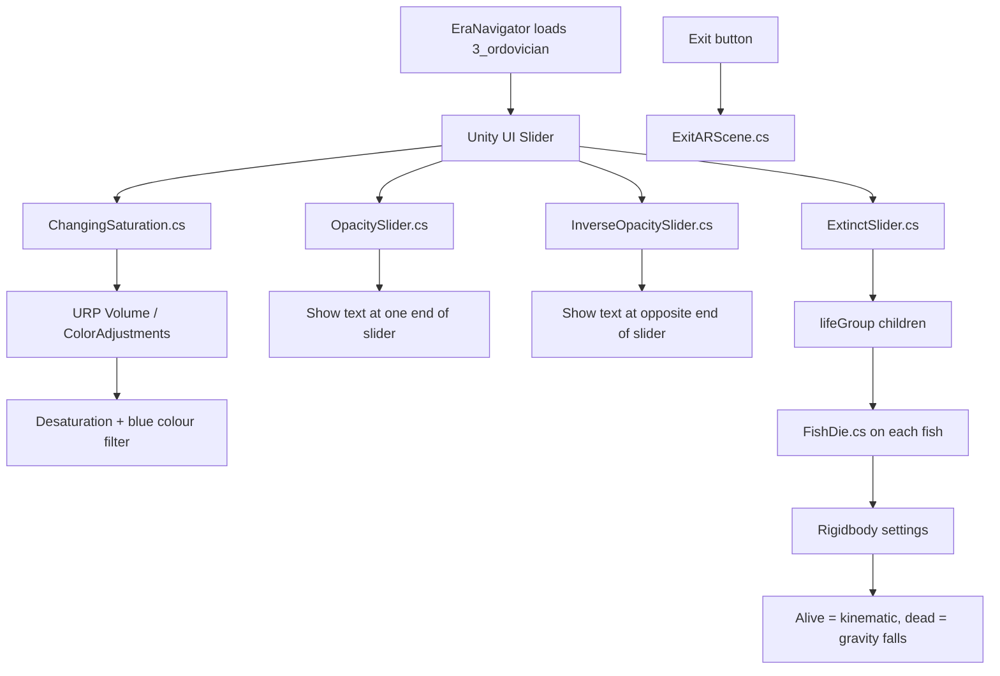

## 6. Silurian Scene: `4_silurian`

Main responsibility: visual/informational exhibit-style AR scene.

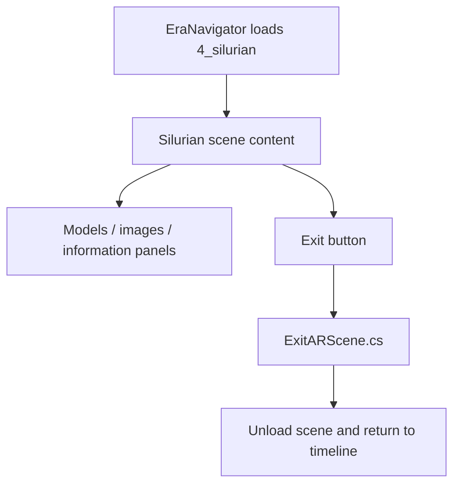

## 7. Devonian Scene: `5_devonian`

Main responsibility: environmental scene with terrain, water, lighting, and information.

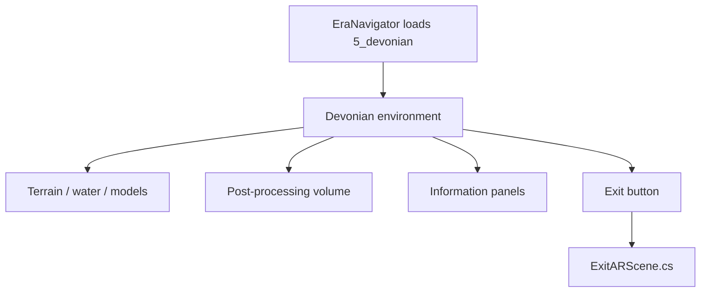

## 8. Lower Carboniferous Scene: `6_lower_carboniferous`

Main responsibility: start a quiz after hiding the normal scene content.

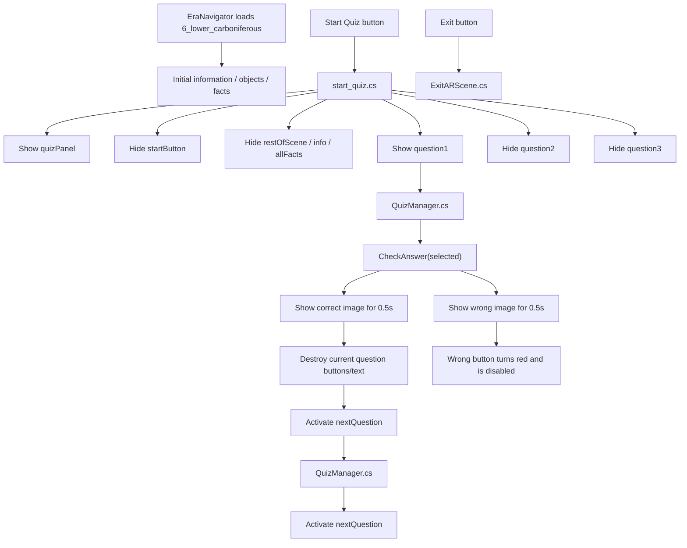

## 9. Upper Carboniferous Scene: `7_upper_carboniferous`

Main responsibility: quiz-based scene using the same shared quiz pattern.

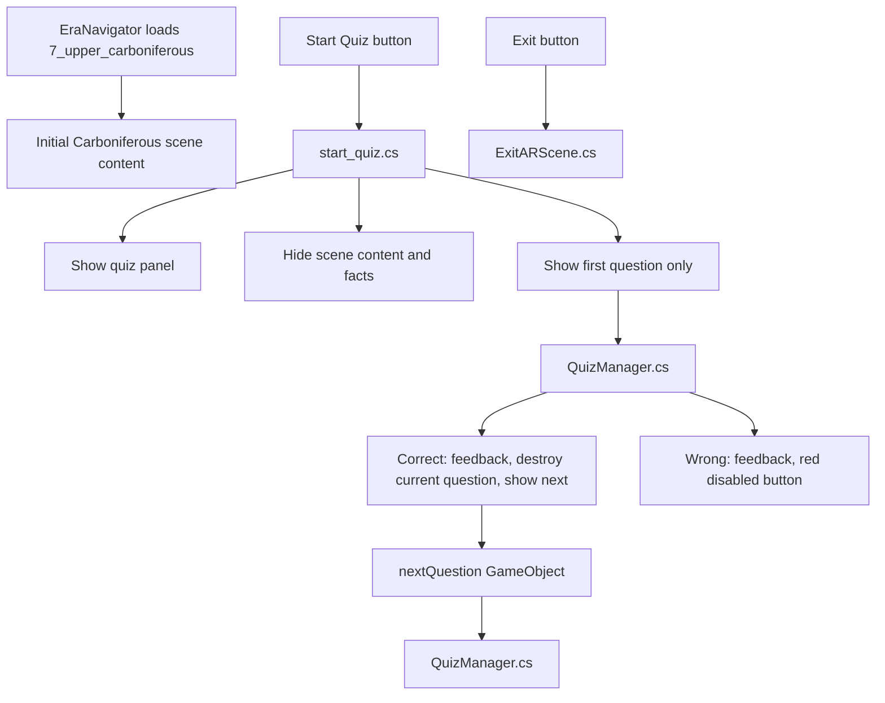

## 10. Triassic Scene: `8_triassic`

Main responsibility: midpoint slider controlling environment and water level.

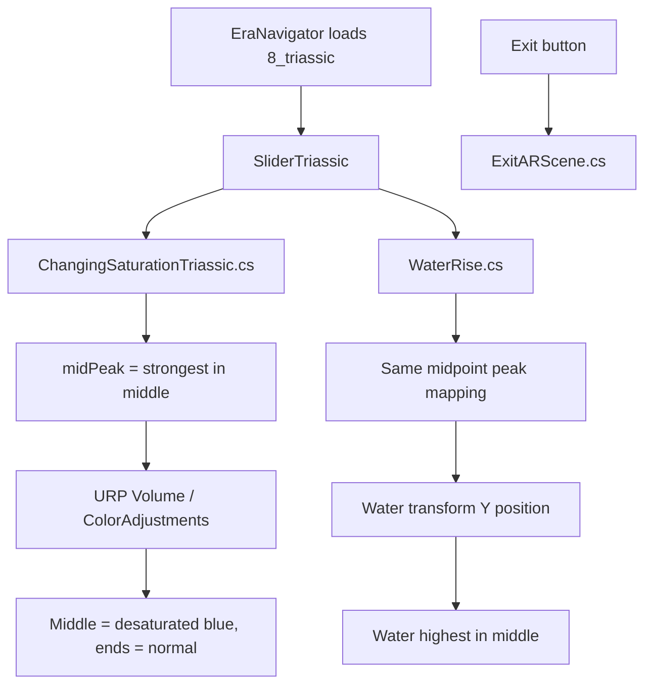

## 11. Jurassic Scene: `9_jurassic`

Main responsibility: quiz gate followed by AR dinosaur placement.

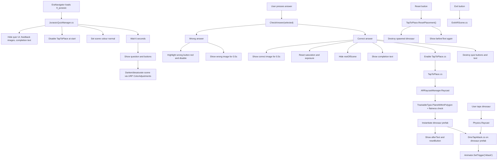

## 12. Cretaceous Scene: `10_cretaceous`

Main responsibility: quiz scene plus swimming movement for prehistoric sea content.

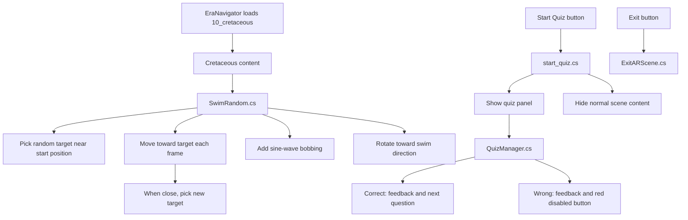

## 13. Tertiary Scene: `11_tertiary`

Main responsibility: quiz-based scene.

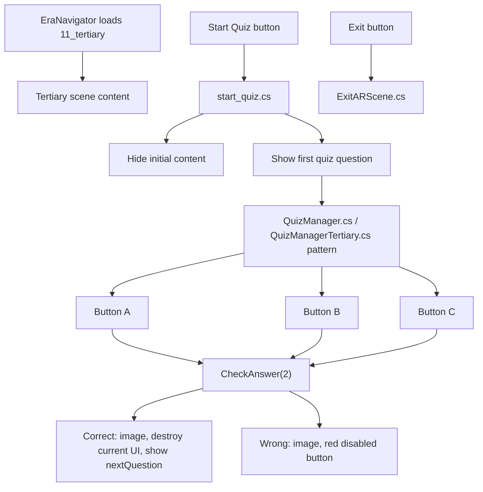

## 14. Quaternary Scene: `12_quarternary`

Main responsibility: Ice Age reveal through fade-in image and text.

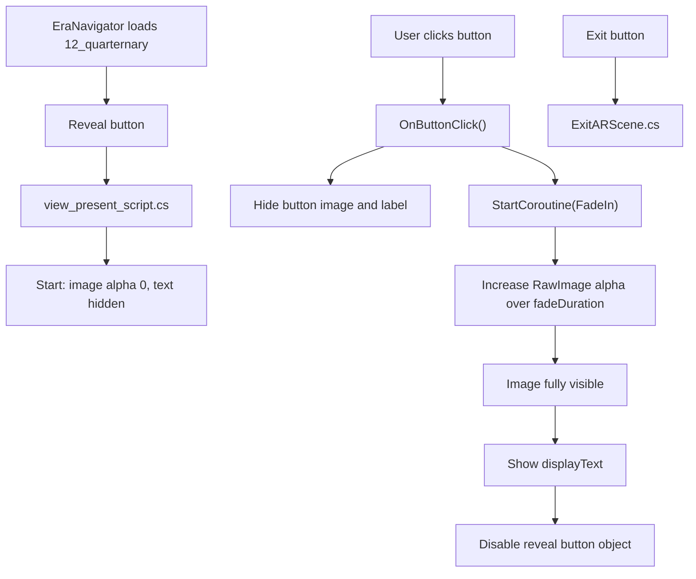

## 15. Shared Quiz Pattern

This pattern appears in Lower Carboniferous, Upper Carboniferous, Cretaceous, and Tertiary.

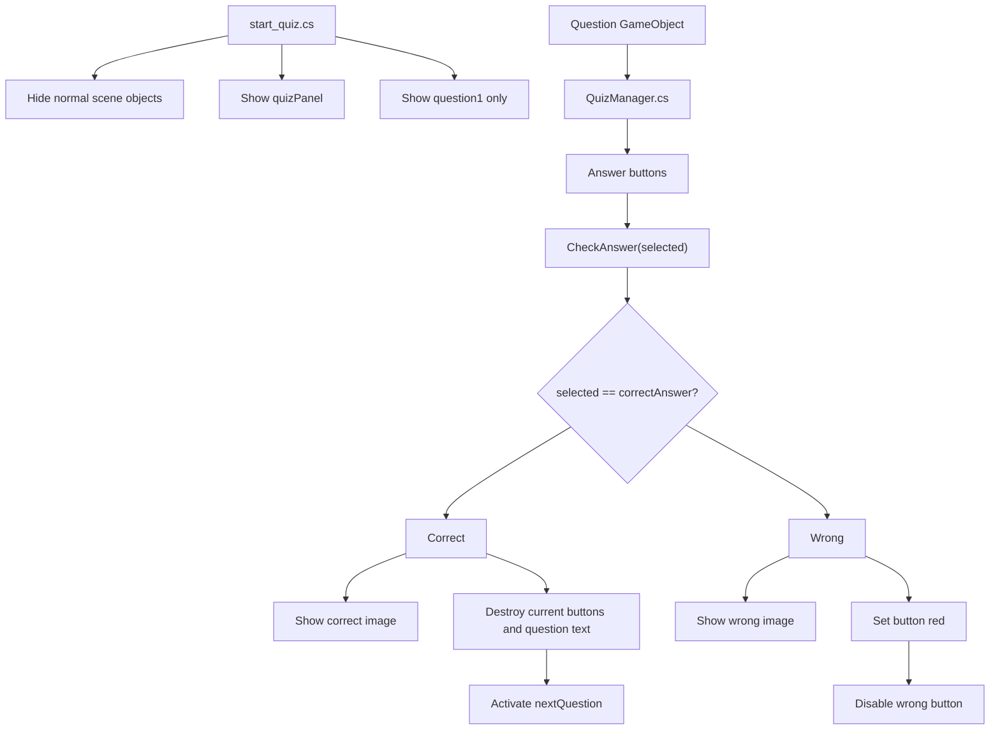

## 16. Shared Exit Pattern

Every AR scene uses the same exit idea.

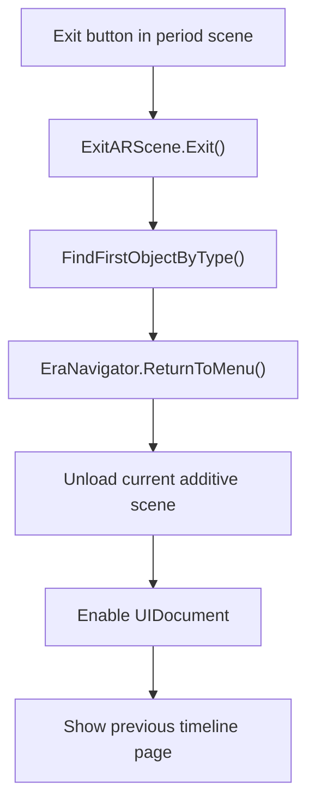
